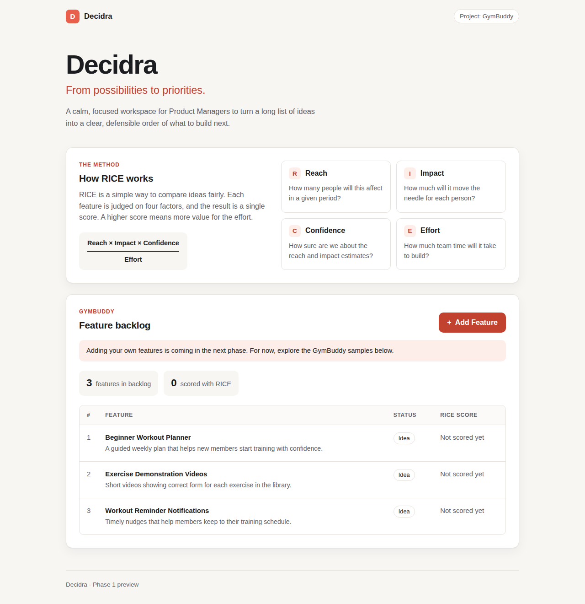

# Decidra

From possibilities to priorities. A simple RICE prioritization app for Product Managers.



## Run it locally

You need Node.js 20 or newer (https://nodejs.org).

```bash
npm install     # download the building blocks (one time)
npm run dev     # start the app, then open http://localhost:5173
```

## Checks

```bash
npm run lint    # looks for common code mistakes
npm run build   # type-checks the code and builds a production version
```

## Project layout

- `src/App.tsx`: the page layout
- `src/components/`: the RICE explainer, backlog summary and backlog table
- `src/data/sampleFeatures.ts`: the three GymBuddy sample features
- `src/types.ts`: the shape of a feature
- `src/index.css`: all styles (plain CSS, coral accent)

## Status

Phase 1: foundation. Shows sample features only. No scoring, saving, AI or exports yet.
