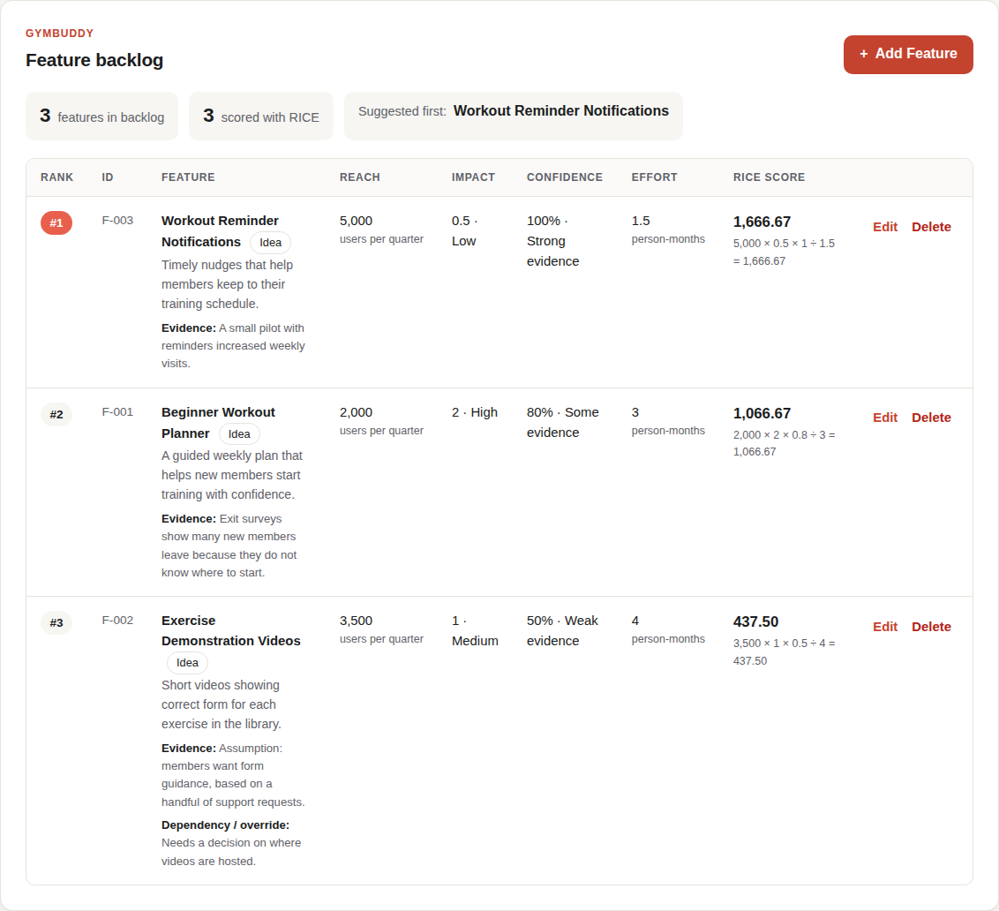

# Decidra

From possibilities to priorities. A simple RICE prioritization app for Product Managers.



## Run it locally

You need Node.js 20 or newer (https://nodejs.org).

```bash
npm install     # download the building blocks (one time)
npm run dev     # start the app, then open http://localhost:5173
```

## Checks

```bash
npm run lint    # looks for common code mistakes
npm run build   # type-checks the code and builds a production version
npm test        # runs the RICE scoring tests
```

## Project layout

- `src/App.tsx`: the page layout
- `src/components/`: the RICE explainer, backlog summary, backlog table and add/edit feature form
- `src/data/sampleFeatures.ts`: the three GymBuddy sample features
- `src/types.ts`: the shape of a feature, including its RICE inputs
- `src/riceOptions.ts`: the Impact and Confidence choices and the Reach time period
- `src/featureValidation.ts`: the form checks and their error messages
- `src/riceScoring.ts`: the RICE calculation, ranking and tie-breaking (no React code)
- `src/riceScoring.test.ts`: tests for the scoring engine
- `src/index.css`: all styles (plain CSS, coral accent)

## Status

- Phase 1: foundation (page layout, RICE explainer, sample backlog).
- Phase 2: add, edit and delete features with RICE inputs (Reach per quarter, Impact, Confidence, Effort in person-months) and helpful error messages. Changes reset on page reload. No scoring, saving, AI or exports yet.
- Phase 3: RICE scores calculated instantly, with the working shown, a live score while you type, and features ranked highest first. Ties go to lower effort, then higher confidence, then the order features were added. Changes still reset on page reload.
