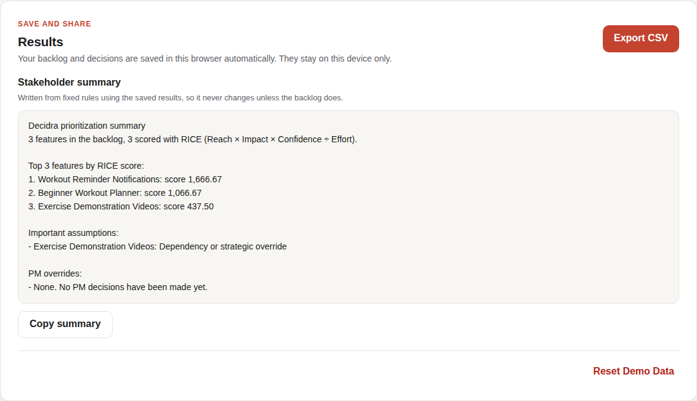

# Decidra

From possibilities to priorities. A simple RICE prioritization app for Product Managers.



## Run it locally

You need Node.js 20 or newer (https://nodejs.org).

```bash
npm install     # download the building blocks (one time)
npm run dev     # start the app, then open http://localhost:5173
```

## Checks

```bash
npm run lint    # looks for common code mistakes
npm run build   # type-checks the code and builds a production version
npm test        # runs the scoring, decision-support, saving and export tests
```

## Project layout

- `src/App.tsx`: the page layout
- `src/components/`: the RICE explainer, backlog summary, backlog table, add/edit feature form and decision panel
- `src/data/sampleFeatures.ts`: the three GymBuddy sample features
- `src/types.ts`: the shape of a feature, including its RICE inputs
- `src/riceOptions.ts`: the Impact and Confidence choices and the Reach time period
- `src/featureValidation.ts`: the form checks and their error messages
- `src/riceScoring.ts`: the RICE calculation, ranking and tie-breaking (no React code)
- `src/riceScoring.test.ts`: tests for the scoring engine
- `src/assumptionChecks.ts`: the five assumption checks and their messages
- `src/sensitivity.ts`: "what if confidence changed?" scenarios
- `src/pmDecision.ts`: accepting the suggested rank or setting a manual priority with a reason
- `src/decisionSupport.test.ts`: tests for the checks, scenarios and decisions
- `src/components/FeatureInsights.tsx`: the per-feature decision panel
- `src/storage.ts`: saving and restoring the backlog and decisions in the browser (localStorage)
- `src/csvExport.ts`: the CSV export, with safe escaping
- `src/stakeholderSummary.ts`: the rule-based stakeholder summary (no AI)
- `src/persistenceExport.test.ts`: tests for saving, the CSV export and the summary
- `src/components/SaveAndExport.tsx`: the save status, export, summary and reset card
- `src/index.css`: all styles (plain CSS, coral accent)

## Status

- Phase 1: foundation (page layout, RICE explainer, sample backlog).
- Phase 2: add, edit and delete features with RICE inputs (Reach per quarter, Impact, Confidence, Effort in person-months) and helpful error messages. Changes reset on page reload. No scoring, saving, AI or exports yet.
- Phase 3: RICE scores calculated instantly, with the working shown, a live score while you type, and features ranked highest first. Ties go to lower effort, then higher confidence, then the order features were added. Changes still reset on page reload.
- Phase 4: explainable decision support. Each feature shows its RICE score, suggested rank, final PM priority, assumption flags and override reason. Five gentle checks flag 100% confidence without evidence (an empty note or one starting "Assumption"), every feature rated maximum impact, effort under 0.5 person-months, zero reach, and dependency or override notes. "What if" scenarios show how the score and rank would move at each other confidence level. The PM can accept the suggested rank or set a manual priority with a required reason; this never changes the RICE score. Decisions still reset on page reload.
- Phase 5: persistence and export. The backlog and PM decisions are saved in this browser automatically and restored on reload; the GymBuddy sample data is used only when nothing is saved. "Reset Demo Data" (with confirmation) brings the sample back. "Export CSV" downloads every feature with its RICE inputs, score, suggested rank, PM priority, evidence note, assumption flags and override reason; text that a spreadsheet could run as a formula is made safe. A short stakeholder summary, written from fixed rules, names the top features, their scores, flagged assumptions and PM overrides. If the browser blocks or fills up its storage, the app keeps working and says changes will not be kept.
